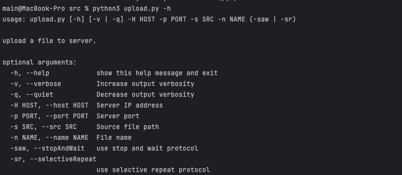
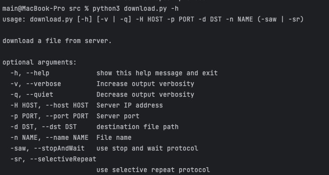
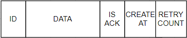

# Introducción a Sistemas Distribuidos

| Nombre alumno                     | Padron | Mail                 | Github                                     |              
|-----------------------------------|--------|----------------------|--------------------------------------------|
| Pablo Salvador Dimartino          | 101231 | pdimartino@fi.uba.ar | [GitHub](https://github.com/psdimartino) |
| Valentina Laura Correa            | 104415 | vcorrea@fi.uba.ar    | [GitHub](https://github.com/valencorrea)   |
| Agustin Ariel Andrade             | 104046 | aandrade@fi.uba.ar   | [GitHub](https://github.com/AgussAndrade) | 
| Stephanie Ingrid Izquierdo Osorio | 104196 | sizquierdo@fi.uba.ar | [GitHub](https://github.com/stephanieizquierdo) | 
| Juan Sebastian Burgos             | 100113 | jsburgos@fi.uba.ar   | [GitHub](https://github.com/juansburgos) | 

## Introducción
La presente entrega contiene los requerimientos pedidos para el trabajo practico
grupal N°1 de la materia Introducción a los sistemas distribuidos - CURSO: 01-Alvarez Hamelin

## Objetivo

En este trabajo práctico buscamos comprender y poner en práctica los conceptos y
herramientas necesarias para la organización de un protocolo RDT.
Para esto desarrollamos una aplicación de arquitectura cliente-servidor 
que implemente las siguientes funcionalidades de transferencia de archivos:

UPLOAD: Transferencia de un archivo del cliente hacia el servidor

DOWNLOAD: Transferencia de un archivo del servidor hacia el cliente

Dicho servidor debe procesar de forma concurrente la transferencia
de archivos de carga y descargas con múltiples clientes.

Para tal finalidad, será necesario comprender cómo se comunican los procesos a 
través de la red, y cuál es el modelo de servicio que la capa de transporte 
le ofrece a la capa de aplicación. Como protocolo de capa de transporte, 
se implementa UDP. El protocolo UDP es un servicio 
sin conexión, no ofrece fiabilidad, ni control de flujos, ni control de conge
stión, es por eso que se implementa una versión utilizando 
el protocolo Stop & Wait y otra versión utilizando el protocolo Selective repeat,
con el objetivo de lograr una transferencia confiable al utilizar el protocolo.

## Hipótesis y supuestos

 - Existe un tamaño máximo contemplado en el protocolo por el tamaño de los paquetes 
 - El tamaño máximo que se puede procesar de los archivos es de 4GB.
 - No se enviaran archivos lo suficientemente grandes como para que se acaben los números de
secuencia y acknowledge resultando en que se reinicie su rango.
 - En caso de que el cliente intente descargar un archivo que no existe en el servidor, este lanzara un error
 - El time out es de 0.1 segundos 
 - Como maximo se permitiran 10 conexiones. Esto es para evitar ataques y congestion del servidor
 - El cliente tiene espacio en su disco para guardar los archivos que descarga.

## Implementación

Procederemos a explicar nuestra estructura

### Servidor

El servidor al levantarse escuchara conexiones y levantara un thread por cada una.
El servidor puede manejar como maximo 10 conexiones en simultaneo.

Para cada conexion, se le informa al cliente su address y se identificara 
la accion deseada del cliente, que protocolo desea usar, las rutas de los archivos 
y el nivel de verbossity. Con esta informacion se procedera a lanzar las funciones pertinentes a la accion y el protocolo elegido.

### Cliente

El cliente puede tener dos funcionalidades que se divide en dos aplicaciones de línea de comandos: upload y download.
#### Upload
El comando upload envía un archivo al servidor para ser guardado con el nombre asignado.

#### Download

El comando download descarga un archivo del servidor para ser guardado en el storage del cleinte con el nombre asignado.

En nuestra implementación estas operaciones sigue los siguientes pasos:
 Crea un Socket con el protocolo correspondiente según el parámetro ingresado 
en protocol en el host "localhost" y el puerto pasado por parámetro.
Luego comenzamos con el handshake en el cual le enviamos una estructura que posee 
una data que es el ID y ademas manda metadata (el tipo de comando, el tamaño del archivo y el nombre de este)
Luego de esto, verificamos que el servidor haya contestado con un status code.
Si todo fue exitoso, se lanzara un hilo segun la acción y el protocolo elegido, selectiveRepeat o Stop and Wait.

### PROTOCOLOS

#### Stop and Wait

El protocolo Stop and Wait consiste en ir enviando y esperando al ACK de cada segmento
antes de poder pasar al siguiente. En este protocolo tenemos los siguientes casos a considerar.
1. Si se envía y recibe su ACK correspondiente al package ID,  se continuara con la lectura del archivo.
2. Desde el lado del que envía, en caso de que se pierda algún paquete que envía data del
archivo, eventualmente saltara un timeout. Esto hará que se vuelva a enviar y repita el 
ciclo hasta que se reciba el ACK o repita una cantidad de veces determinada
por MAX_TIMEOUTS. Si este limite se alcanza se asume que se perdió la conexión con
la otra parte y se procederá a cerrarla.

3. Desde el lado del que lee, mientras lo que se recibio sea menor al tamaño del archivo, se intentara recibir un paquete
y si no se recibe un paquete en el tiempo esperado se saltara un time out y se dará por perdida la conexión.

4. Desde el lado del que lee, si se pierde un ACK enviado como respuesta a un segmento se volverá a
intentar leer.

#### Selective Repeat

Para este protocolo implementamos la siguiente estructura de paquete: 

En este protocolo tenemos la implementacion de una ventana en la cual, para el caso de envio, tenemos en cuenta los siguientes casos:

Si no se termino de leer el archivo y la ventana no esta vacia, leo el archivo y creo un paquete con esa data y el ID correspondiente
se setea el timestamp y se inserta este paquete en la ventana.

Si la ventana esta llena o termino de leer, espera a recibir ACK y va marcando los paquetes que recibio.

Para realizar el deslizamiento de ventana, se fija si los paquetes ya han sido recibidos, y si es asi, los saca de esta.

Para aquellos paquetes que han expirado, es decir que no se obtuvo su ACK, 
se vuelve a reenviarlos, como MAXIMUM_RETRIES veces.
Y en caso de no obtener el ACK de un paquete que ya ha sido repetido MAXIMUM_RETRIES veces, se asume que la coneccion se perdio.

Para el caso de recepcion tenemos la ventana implementada como PriorityQueue y tenemos en cuenta los siguientes casos:

Mientras recibi menos de lo que tengo que recibir y la ventana no está llena, se intentara recibir paquetes.
Se extrae el ID de dicho paquete y se envia para confirmar la recepcion de este. 

Si se recibe el paquete esperado, Se escribe la data en el archivo y se incrementan la cantidad recibida y el id esperado.
En caso de no recibir el paquete esperado, si se recibe un paquete con ID menor, este se descarta.
Si se recibe un paquete que ya estaba en la ventana, se descarta este ultimo.
Y por ultimo, si llega un paquete con ID mayor al que se esperaba, este se inserta en la ventana.

### Ejecución

#### Stop and wait:

Servidor: `python3 start-server.py -H 10.0.0.1 -p 12001 -s lib/files/server-files -saw`

Upload: `python3 upload.py -H 10.0.0.1 -p 12001 -s lib/files/client-files/archivo.jpeg -n archivo-en-server.jpeg -saw`

Download: `python3 download.py -H 10.0.0.1 -p 12001 -s lib/files/client-files/archivo-descargado.jpeg -n archivo-en-server.jpeg -saw`

#### Selective repeat:

Servidor: `python3 start-server.py -H 10.0.0.1 -p 12001 -s lib/files/server-files -sr`

Upload: `python3 upload.py -H 10.0.0.1 -p 12001 -s lib/files/client-files/tp.py -n tp-en-server.py -sr`

Download: `python3 download.py -H 10.0.0.1 -p 12001 -s lib/files/client-files/tp_descargado.pdf -n tp-en-server.pdf -sr`

### Preguntas y respuestas

1. Describa la arquitectura Cliente-Servidor.

La arquitectura cliente-servidor, el servidor es un host que se mantiene siempre activo
y este da servicio a las solicitudes de muchos otros hosts, que son los clientes. Ademas
el servidor tiene una dirección fija y conocida, denominada dirección IP. Puesto que el 
servidor tiene una dirección fija y conocida,
y siempre está activo. Gracias a estas caracteristicas, un cliente siempre puede contactar 
con él enviando un paquete a su dirección IP.

2. ¿Cuál es la función de un protocolo de capa de aplicación?

Un protocolo de la capa de aplicación posee la funcionalidad de definir la comunicacion entre los procesos de una aplicación que son ejecutados en distintos end-points.
Dentro de sus funcionalidades podemos nombrar:

- La sintaxis de los distintos tipos de mensajes, es decir, que campos poseen y cómo se delimitan 
- Los tipos de mensajes intercambiados 
- La semántica de los campos, 
- Las reglas para determinar cuándo y cómo un proceso envía mensajes y
responde a los mismos.
3. Detalle el protocolo de aplicación desarrollado en este trabajo

Se encuentra previamente explicado en la seccion PROTOCOLOS

4. La capa de transporte del stack TCP/IP ofrece dos protocolos: TCP y UDP. ¿Qué servicios proveen dichos protocolos? ¿Cuáles son sus características? ¿Cuando es apropiado utilizar cada uno? 

UDP proporciona los servicios mínimos de un protocolo de la capa de transporte, es
decir multiplexado y demultiplexado, y verificación de integridad; Por eso mismo se lo denomina Best-effort. Además UDP tiene como características que tiene un header minimo, no necesita conexión
y pueden ocurrir pérdida de paquetes y haber paquetes duplicados. TCP en cambio
ofrece los servicios de entrega confiable, control de flujo y control de
congestión, con lo cual no se perderán paquetes ni llegarán duplicados.
Se usa UDP cuando la velocidad en la entrega de los datos importa más que la
confiabilidad de los mismos. Por ejemplo para streaming multimedia, telefonía por
internet o juegos online, donde es probable que un paquete perdido no afecte a
nadie. Por otra parte, TCP se suele usar en el resto de los casos donde la
confiabilidad de entrega es imprescindible. Algunas aplicaciones que utilizan
protocolos de aplicación con TCP son por ejemplo e-mail, web y transferencia de archivos. 

### Otros links
- [Enunciado](https://drive.google.com/file/d/1c0npGce0MuamsgeVyxAR7qn6hFDeaE0t/view?usp=sharing)
